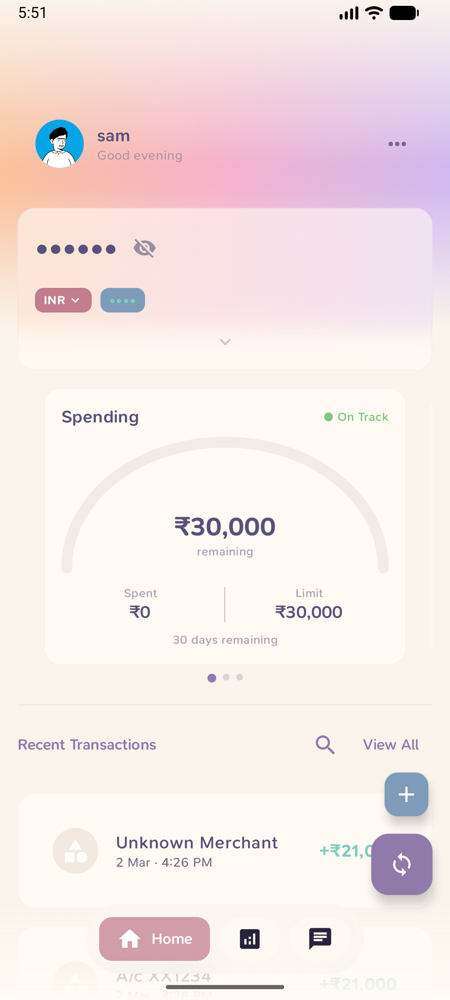
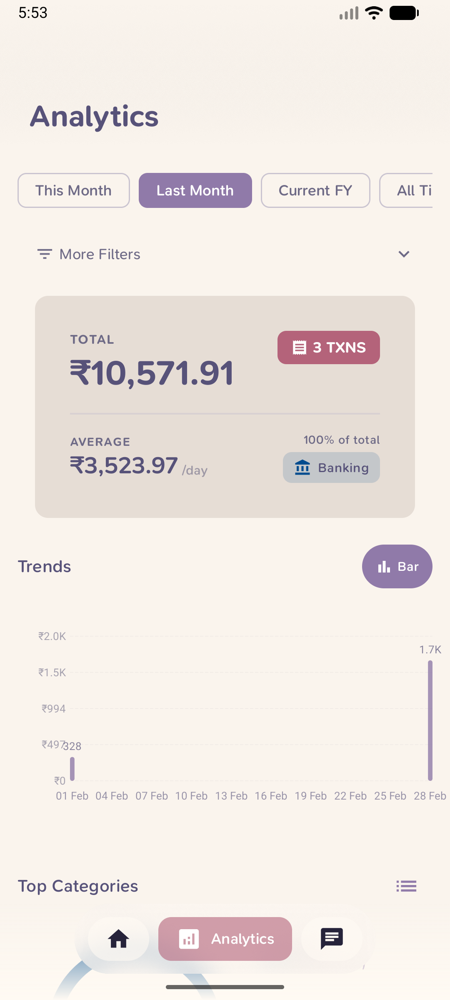
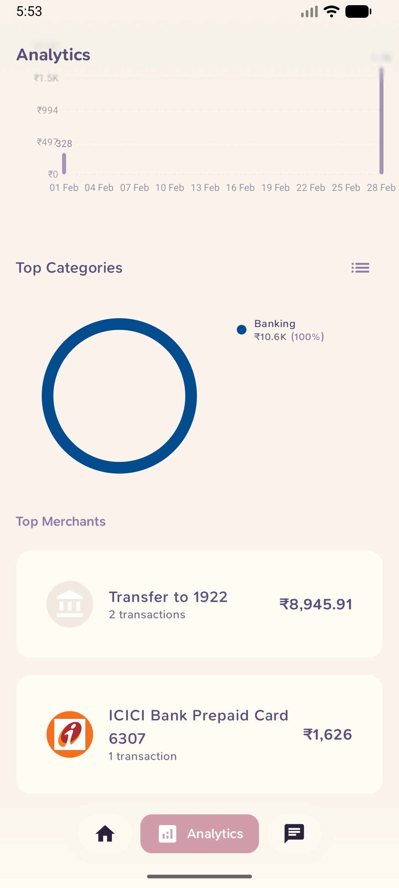
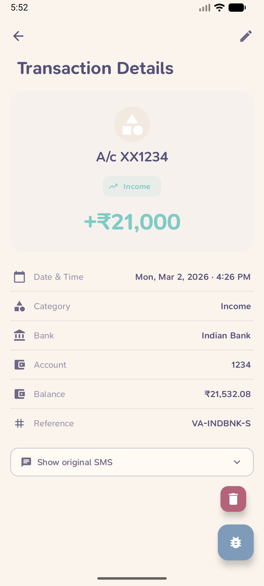
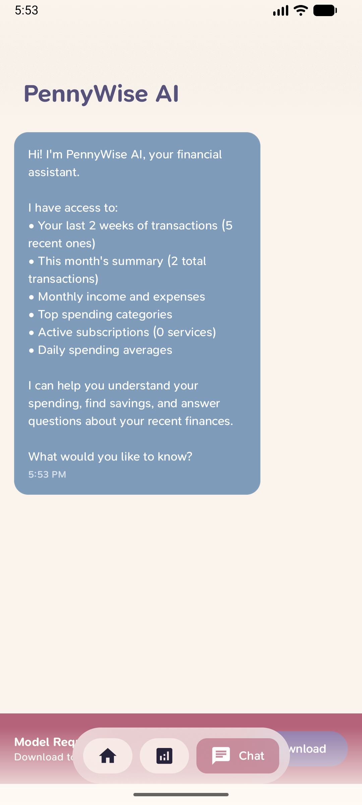
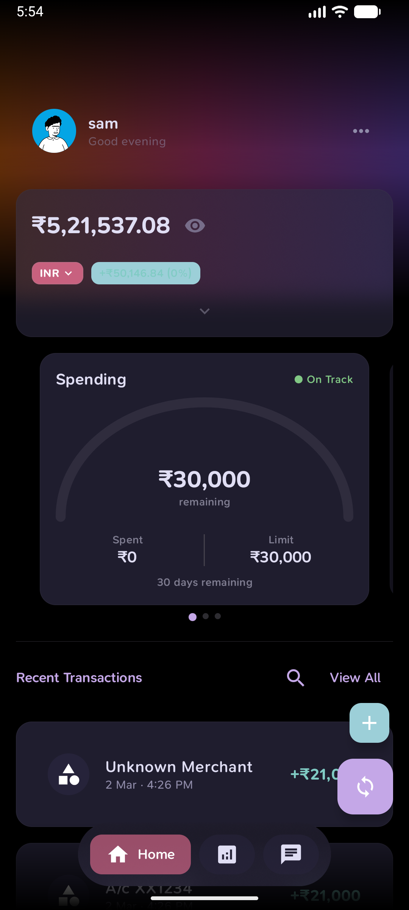
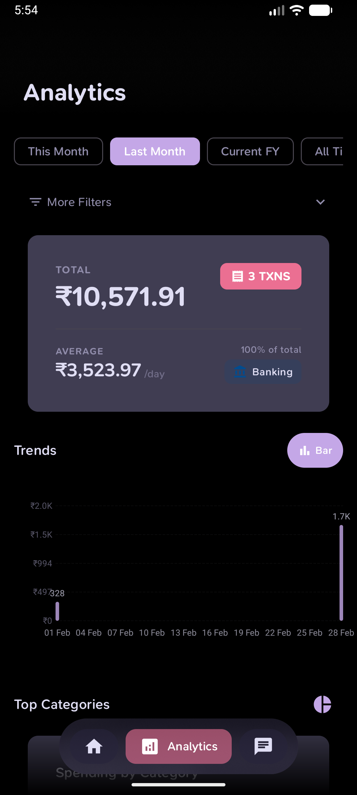
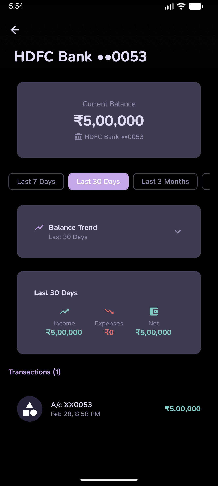
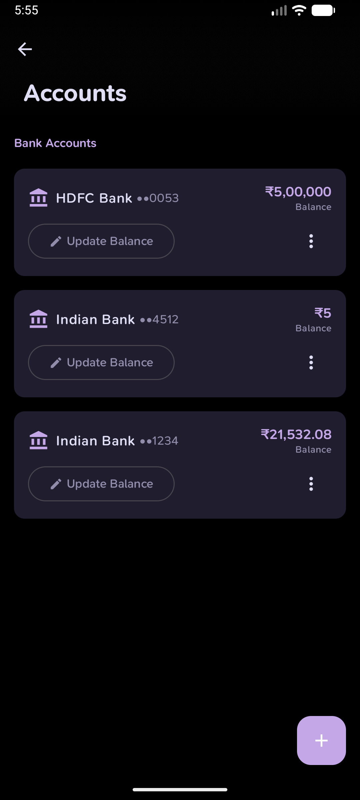
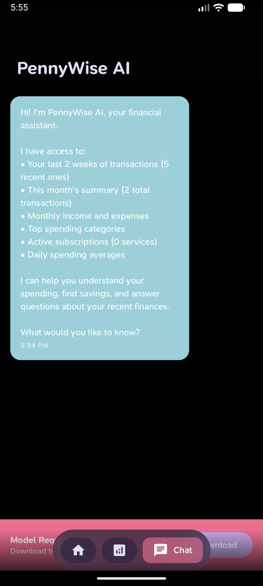

<a name="top"></a>
[](https://github.com/sarim2000/pennywiseai-tracker)
[](https://github.com/sarim2000/pennywiseai-tracker)
[](LICENSE)
[](https://developer.android.com/about/versions/12)
[](https://kotlinlang.org/)
[](https://developers.google.com/mediapipe)
[](https://play.google.com/store/apps/details?id=com.pennywiseai.tracker)
[](https://f-droid.org/packages/com.pennywiseai.tracker/)
[](https://github.com/sarim2000/pennywiseai-tracker/releases)
[](https://github.com/sarim2000/pennywiseai-tracker/commits)
[](https://discord.gg/H3xWeMWjKQ)

## PennyWise AI — Free & Open‑Source, private SMS‑powered expense tracker

Turn bank SMS into a clean, searchable money timeline with on-device AI assistance. 100% private, no cloud processing.


⭐ **Star us on GitHub — join 300+ supporters!**

[](https://x.com/intent/tweet?text=Check%20out%20PennyWise%20AI%20-%20Privacy-first%20expense%20tracker%20with%20on-device%20AI:%20https://github.com/sarim2000/pennywiseai-tracker%20%23Android%20%23PrivacyFirst%20%23OnDeviceAI)
[](https://www.linkedin.com/sharing/share-offsite/?url=https://github.com/sarim2000/pennywiseai-tracker)
[](https://www.reddit.com/submit?title=PennyWise%20AI%20-%20Privacy-first%20expense%20tracker&url=https://github.com/sarim2000/pennywiseai-tracker)
[](https://t.me/share/url?url=https://github.com/sarim2000/pennywiseai-tracker&text=Check%20out%20PennyWise%20AI)

## Overview

Your bank already texts you every transaction — PennyWise turns those SMS into a private, zero-setup expense tracker with on-device AI. No accounts, no cloud, no effort.

<a href="https://play.google.com/store/apps/details?id=com.pennywiseai.tracker">
  
</a>
<a href="https://f-droid.org/packages/com.pennywiseai.tracker">
  
</a>

### How it works

1. **Grant SMS permission** (read-only) — no account creation, no inbox changes, no messages sent.
2. **PennyWise parses your transactions instantly** — extracts amount, merchant, category, and date. New SMS are detected in real-time.
3. **Get insights** — analytics, budgets, subscriptions, and an on-device AI assistant you can ask anything.

## Why PennyWise

**Key Differentiators**

- **🔒 100% On-Device & Private** — All AI processing runs locally, no cloud, no servers, no tracking
- **⚡ Zero Setup** — Just grant SMS permission, no accounts to create, works instantly
- **🆓 Free & Open Source** — AGPL v3 licensed, no ads, no hidden costs

**Core Features**

- **🤖 Smart SMS Parsing** — 85+ banks across 14 countries with real-time detection of incoming SMS
- **🌍 Multi-Currency** — Native support for INR, USD, AED, THB, NPR, ETB, and more with exchange rate management
- **💬 On-Device AI Assistant** — Ask "What did I spend on food?" — powered by Qwen 2.5, runs entirely on your phone
- **🏷️ Auto-Categorization & Smart Rules** — Pattern-based rules that auto-categorize transactions
- **💰 Budget Tracking** — Multiple budget groups (Limit/Target/Expected types), daily allowance, category-level budgets
- **📊 Analytics & Charts** — Bar charts, line trends, heatmaps, category breakdowns, top merchants, custom date ranges
- **🏦 Multi-Account & Balance Tracking** — Track multiple bank accounts with live balance from SMS and balance history
- **🔄 Subscription Detection** — Automatic recurring payment detection with due date alerts
- **🎨 Custom Categories** — Create your own with custom colors and icons

**More Features**

- **🔐 Biometric App Lock** — Fingerprint/face unlock with configurable timeout
- **📱 Home Screen Widgets** — Budget progress and recent transactions at a glance
- **📤 Data Export & Backup** — CSV export for taxes, full backup/restore (.pennywisebackup)
- **🎭 Material You Theming** — Dynamic colors, multiple cover styles (Aurora, Gradient, Wave), light/dark/system themes
- **✏️ Manual Transactions** — Add and edit transactions manually
- **🔍 Search & Filters** — Filter by category, merchant, period, currency, transaction type
- **🎯 Guided Onboarding** — Spotlight tutorial for first-time users

## Supported Banks & Countries

Supporting **85+ banks** across **14 countries** with **multi-currency** capabilities:

### 🇮🇳 India (44 banks) - INR ₹
- **HDFC Bank**, **HDFC Mutual Fund**, **State Bank of India (SBI)**, **ICICI Bank**
- **Axis Bank**, **Punjab National Bank (PNB)**, **IDBI Bank**
- **Indian Bank**, **Federal Bank**, **Karnataka Bank**, **Kerala Gramin Bank**
- **Canara Bank**, **Bank of Baroda**, **Bank of India**
- **Jupiter (CSB Bank)**, **Juspay**, **Kotak Bank**
- **IDFC First Bank**, **Union Bank**, **HSBC Bank**
- **Central Bank of India**, **South Indian Bank**, **JK Bank**
- **Indian Overseas Bank**, **Airtel Payments Bank**, **AMEX**
- **OneCard**, **UCO Bank**, **AU Bank**, **Yes Bank**, **Bandhan Bank**
- **IndusInd Bank**, **Dhanlaxmi Bank**, **Equitas Small Finance Bank**
- **DBS Bank**, **Saraswat Bank**, **City Union Bank**
- **Slice**, **LazyPay**, **Utkarsh Bank**
- **Jio Payments Bank**, **JioPay**, **India Post Payments Bank (IPPB)**
- **Standard Chartered Bank**

### 🇺🇸 USA (7 banks) - USD $
- **Citi Bank**, **Discover Card**, **Old Hickory Credit Union**, **Charles Schwab**
- **Navy Federal Credit Union**, **AdelFi Credit Union**, **Huntington Bank**

### 🇦🇪 UAE (5 banks) - AED د.إ
- **First Abu Dhabi Bank (FAB)**, **Abu Dhabi Commercial Bank (ADCB)**
- **Emirates NBD**, **Liv Bank**, **Mashreq Bank**

### 🇹🇭 Thailand (11 banks) - THB ฿
- **Bangkok Bank (BBL)**, **Kasikorn Bank (KBank)**, **Siam Commercial Bank (SCB)**
- **Krungthai Bank (KTB)**, **Krungsri (BAY)**, **TTB (TMBThanachart)**
- **Government Savings Bank (GSB)**, **BAAC**, **UOB Thailand**
- **CIMB Thai**, **KTC Credit Card** - Thai and English SMS support

### 🇳🇵 Nepal (4 banks) - NPR ₨
- **Laxmi Sunrise Bank**, **Everest Bank**, **NMB Bank (Nabil Bank)**, **Siddhartha Bank**

### 🇪🇹 Ethiopia (4 services) - ETB ብር
- **Commercial Bank of Ethiopia (CBE)**, **Zemen Bank**, **Dashen Bank**
- **Telebirr** - Mobile money service

### 🇹🇿 Tanzania (3 services) - TZS
- **M-Pesa Tanzania**, **Selcom Pesa**, **Tigo Pesa / Mixx by Yas**

### 🇵🇰 Pakistan (2 banks) - PKR ₨
- **Standard Chartered Bank**, **Faysal Bank**

### 🇮🇷 Iran (2 banks) - IRR ﷼
- **Melli Bank (بانک ملی)**, **Parsian Bank (بانک پارسیان)** - Persian SMS support

### 🇸🇦 Saudi Arabia (1 bank) - SAR ﷼
- **Alinma Bank (بنك الإنماء)** - Arabic SMS support

### 🇧🇾 Belarus (1 bank) - BYN Br
- **Priorbank** - Russian/Belarusian SMS support

### 🇨🇴 Colombia (1 bank) - COP $
- **Bancolombia**

### 🇪🇬 Egypt (1 bank) - EGP E£
- **CIB (Commercial International Bank)**

### 🇰🇪 Kenya (1 service) - KES Ksh
- **M-PESA** - Mobile money service

More banks being added regularly! [Request your bank →](https://github.com/sarim2000/pennywiseai-tracker/issues/new?template=bank_support_request.md)

## Privacy First

All AI processing happens on your device using MediaPipe's Qwen 2.5 model — no cloud, no API calls, no data leaving your phone. There are no accounts to create, no sign-ups, no servers collecting your data. Your SMS and financial information stay entirely on your device. The entire codebase is open source (AGPL v3) so anyone can verify exactly what the app does.

## Screenshots

**Light Theme**

<table>
<tr>
<td></td>
<td></td>
<td></td>
<td></td>
<td></td>
</tr>
<tr>
<td align="center">Home</td>
<td align="center">Analytics</td>
<td align="center">Categories</td>
<td align="center">Details</td>
<td align="center">AI Chat</td>
</tr>
</table>

**Dark Theme**

<table>
<tr>
<td></td>
<td></td>
<td></td>
<td></td>
<td></td>
</tr>
<tr>
<td align="center">Home</td>
<td align="center">Analytics</td>
<td align="center">Account Detail</td>
<td align="center">Accounts</td>
<td align="center">AI Chat</td>
</tr>
</table>

## Quick Start

```bash
# Clone repository
git clone https://github.com/sarim2000/pennywiseai-tracker.git
cd pennywiseai-tracker

# Build APK
./gradlew assembleDebug

# Install
adb install app/build/outputs/apk/debug/app-debug.apk
```

### Requirements

- Android 12+ (API 31)
- Android Studio Ladybug or newer
- JDK 11

## Tech Stack

<p align="center">
  <br>
  
</p>

**Architecture**: MVVM • Jetpack Compose • Room • Coroutines • Hilt • MediaPipe AI • Material Design 3

## Community & Support

- **Discord**: Join the community, share feedback, and get help — [Join Discord](https://discord.gg/H3xWeMWjKQ)
- **Issues**: Report bugs or request features — [Open an issue](https://github.com/sarim2000/pennywiseai-tracker/issues)

## Contributing

See [CONTRIBUTING.md](CONTRIBUTING.md) for guidelines.

Please read our [Code of Conduct](CODE_OF_CONDUCT.md) before participating.

```bash
./gradlew test          # Run tests
./gradlew lint   # Check style
```

## Security

Please review our [Security Policy](SECURITY.md) for how to report vulnerabilities.

## Contributors ✨

Thanks goes to these wonderful people ([emoji key](https://allcontributors.org/docs/en/emoji-key)):

<!-- ALL-CONTRIBUTORS-LIST:START - Do not remove or modify this section -->
<!-- prettier-ignore-start -->
<!-- markdownlint-disable -->
<table>
  <tbody>
    <tr>
      <td align="center" valign="top" width="14.28%"><a href="https://github.com/Lucifer1590"><br /><sub><b>Lucifer1590</b></sub></a><br /><a href="#community-Lucifer1590" title="Community Management">👥</a> <a href="https://github.com/sarim2000/pennywiseai-tracker/issues?q=author%3ALucifer1590" title="Bug reports">🐛</a> <a href="#userTesting-Lucifer1590" title="User Testing">📓</a></td>
      <td align="center" valign="top" width="14.28%"><a href="https://github.com/akshaynexus"><br /><sub><b>akshaynexus</b></sub></a><br /><a href="https://github.com/sarim2000/pennywiseai-tracker/commits?author=akshaynexus" title="Code">💻</a></td>
    </tr>
  </tbody>
</table>

<!-- markdownlint-restore -->
<!-- prettier-ignore-end -->

<!-- ALL-CONTRIBUTORS-LIST:END -->

This project follows the [all-contributors](https://github.com/all-contributors/all-contributors) specification. Contributions of any kind welcome!

## Star History

[](https://star-history.com/#sarim2000/pennywiseai-tracker&Date)

## License

GNU Affero General Public License v3.0 - see [LICENSE](LICENSE)

This project is licensed under AGPL v3, which means:
- ✅ You can use, modify, and distribute this software
- ✅ You must share your modifications under the same license
- ✅ If you run a modified version on a server, you must make the source code available to users
- ✅ Patent rights are explicitly granted and protected

---

<p align="center">
<a href="https://github.com/sarim2000/pennywiseai-tracker/releases">Download</a> •
<a href="https://github.com/sarim2000/pennywiseai-tracker/issues">Report Bug</a> •
<a href="https://github.com/sarim2000/pennywiseai-tracker/issues">Request Feature</a>
</p>
